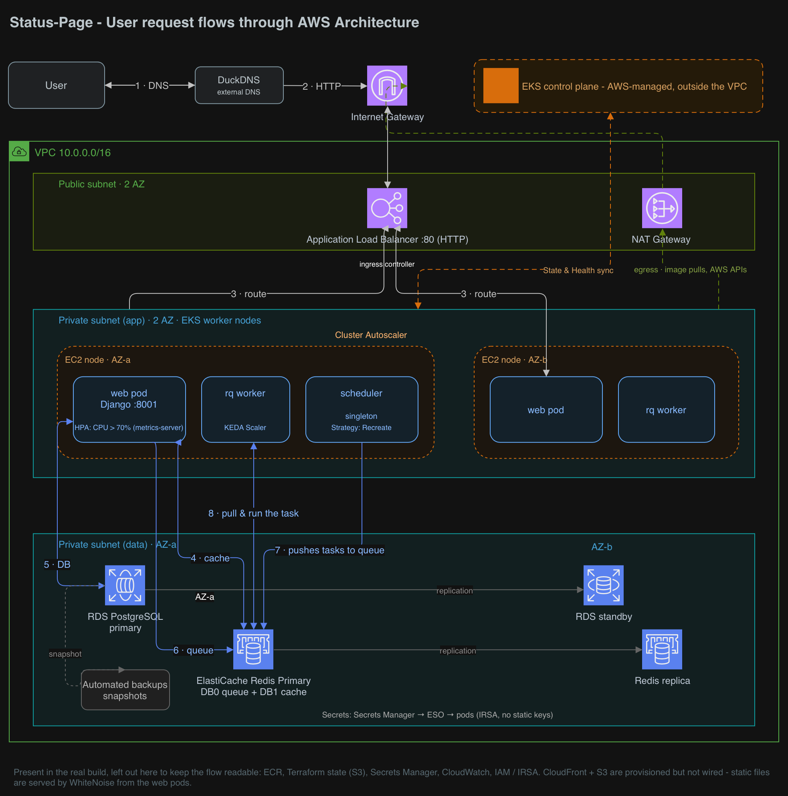

# Status-Page on AWS EKS

Production-grade AWS infrastructure for [Status-Page](https://github.com/Status-Page/Status-Page), an
open-source Django uptime and incident dashboard (pinned at `v2.5.1`).

**We did not write the application. We built everything that runs it** — the network, the cluster, the
data layer, the secrets pipeline, the autoscaling, and the delivery pipeline — entirely as code, on a
$300/month budget.

Built by Rotem and Roei as a DevOps course final project.

---

## Architecture

[](diagrams/aws-infra-flow.png)

One container image runs all three processes — they differ only by the `command` they are started with.

| Layer | Implementation |
|---|---|
| Network | VPC `10.0.0.0/16`, 2 public + 2 private subnets across 2 AZs, single NAT Gateway |
| Compute | EKS 1.36, managed node group — 2–4 × `t3.medium`, On-Demand, AL2023 |
| Database | RDS PostgreSQL, Multi-AZ, storage autoscaling, master password managed by Secrets Manager |
| Cache / queue | ElastiCache Redis, Multi-AZ replica, cluster-mode disabled, TLS in transit |
| Registry | ECR, single repository, immutable tags |
| Ingress | AWS Load Balancer Controller → internet-facing ALB, `target-type: ip` |
| Secrets | Secrets Manager → External Secrets Operator → Kubernetes Secret, pod identity via IRSA |
| Add-ons | ALB Controller, External Secrets Operator, metrics-server, KEDA, Cluster Autoscaler |

Detailed design notes and the reasoning behind each choice: [`docs/architecture-notes.md`](docs/architecture-notes.md).
Editable source: the diagram PNG has the draw.io source embedded — see [`diagrams/`](diagrams/).

## Repository layout

```
infra/        Terraform — 38 resources across 16 files (VPC, EKS, RDS, Redis, ECR, IAM, add-ons)
helm/         Helm chart — 12 templates, one chart deploys all three processes
poc/          Dockerfile, Django settings, and a docker-compose PoC for running the stack locally
monitoring/   Prometheus values and a Grafana dashboard for external uptime probing
diagrams/     Architecture diagram (PNG with embedded draw.io source) and the CI/CD diagram
docs/         Architecture and design notes
.github/      CI/CD workflow
```

## Autoscaling — three independent layers

| Layer | Scales | Trigger |
|---|---|---|
| HPA | `web` pods | CPU above 70% |
| KEDA | `rq-worker` pods | Redis queue depth |
| Cluster Autoscaler | EC2 nodes | Pods that cannot be scheduled |

## Secrets — no static AWS keys anywhere

The pod authenticates to AWS through IRSA (an OIDC trust between the EKS cluster and IAM), so no
long-lived AWS credentials are stored in the cluster, the repository, or CI.

```
Secrets Manager ──> External Secrets Operator ──> Kubernetes Secret ──> pod env
                     (refreshInterval: 1h)
```

The RDS master password is generated and rotated by Secrets Manager (`manage_master_user_password`), and
ESO re-syncs the Kubernetes Secret automatically. The ESO IAM role is scoped to exactly two secret ARNs,
not `*`.

## CI/CD

`.github/workflows/ci-cd.yaml`, triggered on push to `main`. Two jobs:

**`build-and-test`** — `terraform validate`, `helm lint`, and a Trivy configuration scan of `infra/`.

**`deploy`** — authenticates to AWS via GitHub OIDC (no stored credentials), builds the image, scans it
with Trivy, pushes to ECR, clears the previous migration Job, runs `helm upgrade`, waits for the database
migration to finish, and verifies the rollout.

The CI role's Kubernetes permissions are deliberately narrow: write access inside the `statuspage`
namespace only, plus a single name-pinned grant on one cluster-scoped resource. See
[`infra/rbac-github-actions.tf`](infra/rbac-github-actions.tf).

## Monitoring

Prometheus and Grafana run in-cluster with a blackbox exporter probing the public endpoint, giving
external uptime and latency for the service — the same signal the application itself is designed to
report. Metrics are kept in memory with a 2-hour retention window; this is deliberately a lightweight
uptime check, not a full observability stack.

## Cost

| Component | Monthly |
|---|---|
| EKS control plane | $73 |
| Worker nodes (2–4 × t3.medium) | ~$60 |
| RDS + ElastiCache (both Multi-AZ) | ~$75 |
| NAT Gateway | $32 |
| ALB + CloudFront/S3 | ~$20 |
| **Total** | **~$260 / month** (budget: $300) |

## Design decisions

Choices we made deliberately, including where we chose *not* to add complexity:

- **Managed node groups over Fargate.** Fargate would have been slightly cheaper at this scale, but it
  runs no DaemonSets, removes the Cluster Autoscaler layer entirely, and adds 60–90 seconds to pod
  startup. We paid a little more to keep a standard cluster.
- **Managed node groups over Karpenter.** Karpenter solves bin-packing and instance-diversity problems
  that a fixed two-to-four node cluster does not have.
- **One image, three Deployments.** Three images would mean three builds, three scans, and three places
  for versions to drift apart.
- **The migration Job is a plain Job, not a Helm hook.** Helm hooks cannot read ConfigMaps and Secrets
  created by the same chart. The trade-off is that the Job is immutable, so CI deletes it before each
  upgrade.
- **Scheduler runs as a singleton with `strategy: Recreate`.** A rolling update would briefly run two
  schedulers, and every scheduled job would fire twice.
- **`topologySpreadConstraints` across nodes and AZs**, so a single AZ failure cannot take out every
  replica.
- **Inline IAM role policies instead of standalone managed policies**, because the course-managed AWS
  account denies `iam:GetPolicyVersion`.
- **WhiteNoise for static files** instead of the provisioned S3 + CloudFront path, chosen for delivery
  speed near the deadline. The S3/CloudFront infrastructure exists in Terraform but is not wired to the
  application.

## Known limitations

Honest list — these are real and were accepted knowingly:

- **Single NAT Gateway.** A genuine single point of failure, kept to save ~$32/month. Real production
  would run one per AZ.
- **HTTP only, no TLS.** The public hostname is served by DuckDNS, which resolves to IPs rather than
  CNAMEs, making ACM DNS validation against an ALB impractical.
- **No GitOps.** Deployment is push-based from GitHub Actions. Argo CD earns its cost at team scale, not
  at two people.
- **S3 + CloudFront are provisioned but unused** — see the WhiteNoise decision above.
- **Upstream application archived since October 2025**, so no further security patches are coming from
  it. Image scanning in the pipeline is the mitigation for that gap.

## Running it

Prerequisites: Terraform ≥ 1.10, AWS CLI, `kubectl`, Helm, and an AWS account.

```bash
cd infra
terraform init
terraform apply
```

Terraform provisions the network, cluster, data layer, and add-ons, and stores state in S3 with native
state locking. Then deploy the application:

```bash
aws eks update-kubeconfig --name ro-ro-statuspage-cluster --region us-east-1
helm upgrade --install statuspage helm/statuspage -n statuspage --create-namespace
```

To run the whole stack locally instead, see [`poc/README.md`](poc/README.md).

## Work split

**Rotem** — network and cluster (VPC, EKS, all five add-ons), IAM and GitHub OIDC, the autoscaling and
resilience layer (HPA, KEDA, NetworkPolicy, PodDisruptionBudget, topology spread), the full CI/CD
pipeline including the Trivy gates and Kubernetes RBAC, static file serving, and monitoring.

**Roei** — data layer (RDS, ElastiCache, S3/CloudFront), ECR, containerization (single Dockerfile,
env-driven Django configuration), and the initial Helm chart (Deployments, Service, ConfigMap, migration
Job, ExternalSecrets).

Architecture was designed together.
